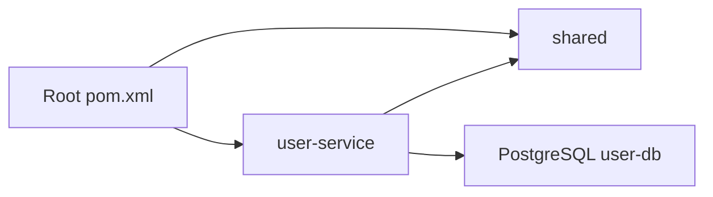

# Cấu Trúc Dự Án

Tài liệu này mô tả cấu trúc thư mục, module và vai trò của các file quan trọng trong backend.

## Tổng quan thư mục

```text
backend/
├── .mvn/
├── deployment/
│   └── docker-compose/
│       └── infra.yml
├── document/
│   ├── structure.md
│   ├── high-level-design.md
│   └── backend-design.docx
├── rules/
├── shared/
│   ├── pom.xml
│   └── src/main/java/sharing/
├── user-service/
│   ├── pom.xml
│   └── src/
├── pom.xml
├── README.md
└── Taskfile.yml
```

## Root project

### `pom.xml`

Root POM khai báo project cha dạng Maven multi-module.

Module hiện có:

- `shared`
- `user-service`

Các version chính được quản lý ở root:

- Java `25`
- Spring Boot `4.0.6`
- Lombok `1.18.46`
- MapStruct `1.6.3`
- PostgreSQL JDBC `42.7.11`
- Flyway `12.6.0`
- Spotless `3.4.0`

Root POM cũng cấu hình Spotless với Palantir Java Format để kiểm tra format code khi build.

### `Taskfile.yml`

Chứa các lệnh tiện ích cho development:

| Task | Mục đích |
| --- | --- |
| `build_shared` | Build và install module `shared`. |
| `start_infra` | Chạy Docker Compose cho hạ tầng local. |
| `stop_infra` | Dừng và xóa container hạ tầng local. |
| `restart_infra` | Restart hạ tầng local. |
| `run_user` | Build `shared`, sau đó chạy `user-service`. |
| `format` | Kiểm tra format. |
| `format_fix` | Tự sửa format. |

### `README.md`

README tổng của dự án, gồm mô tả ngắn, công nghệ sử dụng và hướng dẫn chạy nhanh.

## `deployment/`

Thư mục chứa cấu hình triển khai/hạ tầng.

```text
deployment/
└── docker-compose/
    └── infra.yml
```

`infra.yml` hiện bật PostgreSQL local:

| Thuộc tính | Giá trị |
| --- | --- |
| Service | `user-db` |
| Image | `postgres:18-alpine` |
| Database | `user-db` |
| Username | `admin` |
| Password | `admin@123` |
| Port mapping | `15432:5432` |

Trong file này cũng có block Kafka và Kafka UI, nhưng đang được comment nên chưa chạy mặc định.

## `document/`

Thư mục chứa tài liệu dự án.

```text
document/
├── structure.md
├── high-level-design.md
└── backend-design.docx
```

Vai trò:

- `structure.md`: tài liệu cấu trúc dự án hiện tại.
- `high-level-design.md`: tài liệu thiết kế mức cao.
- `backend-design.docx`: tài liệu backend design dạng Word.

## `shared/`

`shared` là module dùng chung cho các service.

```text
shared/
├── pom.xml
└── src/main/java/sharing/
    ├── base/
    ├── configs/
    ├── constants/
    ├── dtos/
    ├── enums/
    ├── exceptions/
    ├── utils/
    └── TestRun.java
```

### `sharing.base`

Chứa các abstraction dùng chung:

| Package | Vai trò |
| --- | --- |
| `base.controller` | `BaseController`, cung cấp endpoint CRUD/search mặc định. |
| `base.entity` | `BaseEntity`, chứa `id`, `code`, audit fields và `deletedAt`. |
| `base.repository` | `BaseRepository`, kế thừa `JpaRepository` và `JpaSpecificationExecutor`. |
| `base.service` | `BaseService`, contract CRUD/search. |
| `base.service.impl` | `BaseServiceImpl`, implementation CRUD/search và soft delete. |
| `base.mapper` | `BaseMapper`, contract mapping giữa request/entity/response. |
| `base.exception` | Exception cơ sở như `ResourceNotFoundException`. |

### `sharing.configs`

Chứa cấu hình dùng chung:

- `JpaAuditingConfig`: bật JPA auditing, auditor mặc định là `system`.
- `GlobalMapperConfig`: cấu hình MapStruct, bỏ qua field null khi update entity.

### `sharing.constants`

Chứa constant:

- `DateConstant`: format datetime.
- `UserSerivceConstant`: base API path và tên bảng user profile.

Lưu ý: tên hiện tại trong code là `UserSerivceConstant`, đang sai chính tả so với `UserServiceConstant`.

### `sharing.dtos`

Chứa DTO dùng chung:

- `PagedRequest`
- `PagedResponse`
- `ErrorCode`
- `user_service/UserProfileRequest`
- `user_service/UserProfileResponse`

### `sharing.exceptions`

Chứa xử lý lỗi chung:

- `AppException`
- `GlobalExceptionHandler`

Error response dùng Spring `ProblemDetail`.

### `sharing.utils`

Chứa UUIDv7 support:

- `UUIDv7`
- `UUIDv7Generator`

## `user-service/`

`user-service` là service quản lý hồ sơ người dùng.

```text
user-service/
├── pom.xml
└── src/
    ├── main/
    │   ├── java/com/motel/user_service/
    │   │   ├── controller/
    │   │   ├── entity/
    │   │   ├── mapper/
    │   │   ├── repository/
    │   │   ├── service/
    │   │   └── UserServiceApplication.java
    │   └── resources/
    │       ├── application.yaml
    │       └── db/migration/
    └── test/java/com/motel/user_service/
```

### Application

`UserServiceApplication` là entrypoint của service.

Service scan hai package:

```java
@SpringBootApplication(scanBasePackages = {"com.motel.user_service", "sharing"})
```

Cần scan `sharing` để nhận config, exception handler và các bean từ module `shared`.

### Controller

`UserProfileController`:

- Route base: `/api/v1/user-profiles`
- Kế thừa `BaseController`
- Có sẵn các endpoint create, get by id, get all, search, update và delete.

### Service

`UserProfileService` kế thừa `BaseService`.

`UserProfileServiceImpl` kế thừa `BaseServiceImpl`, dùng logic CRUD/search mặc định.

### Repository

`UserProfileRepository` kế thừa `BaseRepository<UserProfile, UUID>`.

Method riêng hiện có:

- `findByKeycloakId`
- `findByEmailAndDeletedAt`

### Mapper

`UserProfileMapper` dùng MapStruct và kế thừa `BaseMapper`.

### Entity

`UserProfile` map tới bảng `user_profiles`.

Field chính:

- `keycloakId`
- `landlordId`
- `role`
- `fullName`
- `email`
- `phone`
- `avatarUrl`
- `zaloUid`
- `sensitivityClearance`
- `isActive`
- `lastLoginAt`

Entity kế thừa `BaseEntity`, nên có thêm:

- `id`
- `code`
- `createdBy`
- `createdAt`
- `updatedBy`
- `updatedAt`
- `deletedAt`

### Resources

`application.yaml` cấu hình:

- App name: `user-service`
- Port: `8091`
- Datasource: `jdbc:postgresql://localhost:15432/user-db`
- Hibernate `ddl-auto: none`

`db/migration/V1__init_user_profile.sql` tạo bảng `user_profiles`.

## Luồng phụ thuộc



`user-service` phụ thuộc vào `shared`, nên khi chạy service riêng cần build/install `shared` trước.

## Ghi chú quan trọng

- API success hiện trả trực tiếp DTO hoặc `PagedResponse`, chưa dùng wrapper `ApiResponse`.
- Delete mặc định là soft delete bằng field `deletedAt`.
- Search mặc định hỗ trợ phân trang, sort, keyword trên `code`, khoảng thời gian theo `createdAt` và dynamic filter theo query param.
- Migration hiện chưa có cột `created_by` và `updated_by`, trong khi `BaseEntity` có field `createdBy` và `updatedBy`. Nếu runtime báo thiếu cột, cần thêm migration mới để đồng bộ schema.
